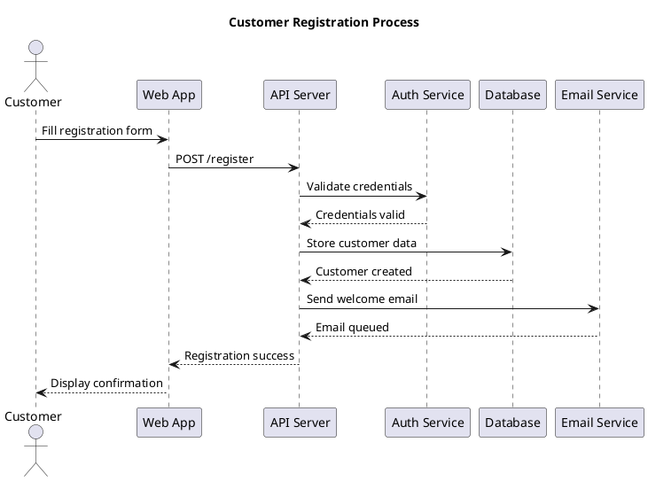

<!--
Document: Architecture Diagrams
Version: 1.0.0
Last Updated: 2025-03-20
Last Updated By: Bayat Platform Team
Change Log:
- 2023-03-19: Initial version
-->

# Architecture Diagrams

This document provides standards, templates, and examples for creating architecture diagrams for Bayat projects.

## Diagram Types and When to Use Them

| Diagram Type | Purpose | When to Use |
|--------------|---------|------------|
| Context Diagram | Show system boundaries and external entities | Project kickoff, stakeholder communication |
| Container Diagram | Illustrate high-level technical components | Architecture planning, technical overview |
| Component Diagram | Detail internal structure of containers | Detailed design, implementation guidance |
| Sequence Diagram | Visualize interactions between components | Process design, API interactions |
| Deployment Diagram | Map components to infrastructure | Deployment planning, infrastructure design |
| Entity-Relationship Diagram | Illustrate data models | Database design, data architecture |

## Diagram Standards

All architecture diagrams should:

1. Use consistent notation (preferably C4 model)
2. Include a title, legend, and date
3. Be created with approved tools (PlantUML, draw.io, Mermaid)
4. Be version controlled alongside code
5. Be referenced in relevant documentation

## PlantUML Examples

### Context Diagram

```plantuml
@startuml
!include https://raw.githubusercontent.com/plantuml-stdlib/C4-PlantUML/master/C4_Context.puml

LAYOUT_WITH_LEGEND()

title System Context diagram for Customer Management System

Person(customer, "Customer", "A customer of the retail system")
Person(admin, "Administrator", "System administrator")

System(cms, "Customer Management System", "Allows administrators to manage customer data")

System_Ext(email, "Email System", "Sends emails to customers")
System_Ext(payment, "Payment Provider", "Processes payments")

Rel(customer, cms, "Uses", "HTTPS")
Rel(admin, cms, "Manages customer data", "HTTPS")
Rel(cms, email, "Sends notifications via", "SMTP")
Rel(cms, payment, "Processes payments via", "API")

@enduml
```

### Container Diagram

```plantuml
@startuml
!include https://raw.githubusercontent.com/plantuml-stdlib/C4-PlantUML/master/C4_Container.puml

LAYOUT_WITH_LEGEND()

title Container diagram for Customer Management System

Person(customer, "Customer", "A customer of the retail system")
Person(admin, "Administrator", "System administrator")

System_Boundary(cms, "Customer Management System") {
    Container(web_app, "Web Application", "React", "Provides customer management functionality to administrators")
    Container(api, "API", "Node.js, Express", "Handles customer data operations")
    Container(db, "Database", "PostgreSQL", "Stores customer information")
    Container(auth, "Auth Service", "Node.js, Passport", "Handles authentication and authorization")
}

System_Ext(email, "Email System", "Sends emails to customers")
System_Ext(payment, "Payment Provider", "Processes payments")

Rel(customer, web_app, "Uses", "HTTPS")
Rel(admin, web_app, "Manages customer data via", "HTTPS")
Rel(web_app, api, "Makes API calls to", "JSON/HTTPS")
Rel(api, db, "Reads from and writes to", "SQL/TCP")
Rel(api, auth, "Authenticates using", "JSON/HTTPS")
Rel(api, email, "Sends emails using", "SMTP")
Rel(api, payment, "Processes payments using", "API")

@enduml
```

### Sequence Diagram



## Implementation Guidance

### Adding Diagrams to Documentation

1. Create diagram source files in the `/docs/architecture/diagrams/` directory
2. Reference diagrams in Markdown using relative links
3. Include both the diagram image and the source file

### Tools Configuration

#### PlantUML

1. Install PlantUML locally: `brew install plantuml`
2. Use the VSCode PlantUML extension for previewing
3. Generate images with: `plantuml -tpng diagram.puml`

#### Draw.io

1. Use the desktop application or web version
2. Export as PNG and SVG formats
3. Save source files with .drawio extension

## Templates

The following templates are available in the `/docs/architecture/diagrams/templates/` directory:

1. System Context Template
2. Container Template
3. Component Template
4. Sequence Template
5. Deployment Template
6. Entity-Relationship Template

## Best Practices

1. **Less is more**: Include only the necessary information
2. **Consistency**: Use the same notation across all diagrams
3. **Hierarchy**: Start with high-level diagrams, then drill down
4. **Collaboration**: Review diagrams with the team
5. **Maintenance**: Update diagrams as the architecture evolves
