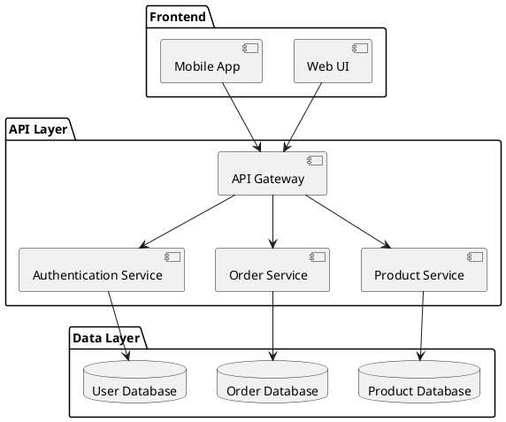

# Technical Documentation Standards

This document outlines the standards and best practices for creating technical documentation across all Bayat projects. Technical documentation includes architecture documents, design specifications, technical guides, and other documentation aimed at developers and technical stakeholders.

## Table of Contents

- [Documentation Types](#documentation-types)
- [Documentation Structure](#documentation-structure)
- [Diagrams and Models](#diagrams-and-models)
- [Code Documentation](#code-documentation)
- [Technical Writing Style](#technical-writing-style)
- [Documentation Management](#documentation-management)
- [Documentation Review](#documentation-review)
- [Templates](#templates)
- [Tools and Formats](#tools-and-formats)
- [Knowledge Sharing](#knowledge-sharing)

## Documentation Types

Technical documentation at Bayat should include the following types:

### Architecture Documentation

Document high-level system structure:

- **System Context**: System boundaries and external dependencies
- **Component Diagrams**: Major components and their interactions
- **Design Decisions**: Key architectural decisions and their rationales
- **Quality Attributes**: How the architecture addresses quality requirements
- **Constraints**: Technical, business, and regulatory constraints
- **Architecture Principles**: Guiding principles for development

### Design Documentation

Detail implementation specifics:

- **System Design**: Detailed design of system components
- **Data Models**: Entity relationships and data structures
- **API Specifications**: Interface definitions and protocols
- **State Diagrams**: State transitions and business processes
- **Sequence Diagrams**: Interaction sequences for key scenarios
- **Class Diagrams**: Object models and class relationships

### Technical Guides

Provide guidance for developers:

- **Development Environment**: Setup and configuration
- **Coding Standards**: Language-specific coding guidelines
- **Build Procedures**: How to build and package the software
- **Deployment Guides**: How to deploy and configure the system
- **Maintenance Procedures**: Routine maintenance tasks
- **Troubleshooting Guides**: Common issues and solutions

### Operational Documentation

Support production operations:

- **Monitoring Setup**: What to monitor and alerting thresholds
- **Backup and Recovery**: Data backup and system recovery procedures
- **Scaling Procedures**: How to scale the system
- **Incident Response**: How to respond to production incidents
- **Security Procedures**: Security protocols and incident response
- **Performance Tuning**: Guidelines for optimizing performance

## Documentation Structure

### Standard Structure

Technical documents should follow this general structure:

1. **Title Page**: Document title, version, date, and authors
2. **Document Control**: Version history, review status, approval status
3. **Table of Contents**: For documents longer than a few pages
4. **Introduction**: Purpose, scope, audience, and references
5. **Background/Context**: Relevant information for understanding the document
6. **Main Content**: Organized by topic with consistent hierarchy
7. **Glossary**: Definitions of terms, acronyms, and abbreviations
8. **References**: Related documents, standards, and external sources
9. **Appendices**: Supplementary information

### Architecture Document Structure

Architecture documents should include:

1. **Executive Summary**: Brief overview for non-technical stakeholders
2. **System Context**: Where the system fits within the broader environment
3. **Architectural Goals and Constraints**: What the architecture must achieve
4. **Architectural Approach**: Overall approach and patterns used
5. **System Architecture**: Components, interfaces, and data flows
6. **Quality Attributes**: How non-functional requirements are addressed
7. **Architectural Decisions**: Key decisions and their rationales
8. **Deployment Architecture**: How the system is deployed
9. **Development View**: How the codebase is organized
10. **Future Roadmap**: Planned architectural evolution

### Technical Document Naming

Use consistent naming conventions:

- **Format**: `[Project]-[DocumentType]-[Component]-[Version].[extension]`
- **Example**: `PaymentSystem-ArchitectureDesign-API-v1.2.md`

Maintain a document registry to track all technical documentation.

## Diagrams and Models

### Diagram Standards

Follow these standards for all technical diagrams:

- Use UML 2.x notation for standard diagram types
- Use C4 model for architectural diagrams
- Include a legend for custom symbols or colors
- Maintain consistent diagram styles within a document
- Ensure diagrams are legible when printed in black and white
- Use vector formats where possible (SVG)
- Include descriptive captions

### Required Diagrams

Include these minimum diagram types for systems:

- **Context Diagram**: System boundaries and external entities
- **Container Diagram**: High-level components (web servers, databases, etc.)
- **Component Diagram**: Major components within containers
- **Data Model**: Entity-relationship or class diagrams
- **Deployment Diagram**: Physical deployment architecture
- **Sequence Diagrams**: For key interactions

### Diagram Tools

Use the following approved tools:

- **PlantUML**: For UML diagrams in text format
- **draw.io/diagrams.net**: For general diagramming
- **Mermaid**: For diagrams in Markdown
- **Lucidchart**: For collaborative diagramming
- **Enterprise Architect**: For complex system modeling

### Diagram Examples

PlantUML Component Diagram:



C4 Context Diagram:

```
+-------------------+      +--------------------+
|                   |      |                    |
|   Customer        +----->+   Payment System   |
|                   |      |                    |
+-------------------+      +---------+----------+
                                     |
                                     v
+-------------------+      +--------------------+
|                   |      |                    |
|   Merchant        |<-----+   Banking System   |
|                   |      |                    |
+-------------------+      +--------------------+
```

## Code Documentation

See also: [Code Documentation Standards](code.md)

### API Documentation

Document APIs comprehensively:

- **Purpose**: What the API does
- **Authentication**: How to authenticate
- **Endpoints**: All available endpoints
- **Request Format**: Parameters, headers, and body structure
- **Response Format**: Status codes, headers, and body structure
- **Error Handling**: Error codes and messages
- **Rate Limiting**: Any usage limits
- **Examples**: Request and response examples
- **SDKs**: Available client libraries

### Database Documentation

Document database schemas:

- **Entity Descriptions**: Purpose of each table/collection
- **Field Definitions**: Name, type, constraints, and purpose
- **Relationships**: How entities relate to each other
- **Indexes**: What indexes exist and why
- **Constraints**: Business rules enforced by the schema
- **Query Patterns**: Common query patterns and optimization hints
- **Migration Procedures**: How to safely migrate schemas

## Technical Writing Style

### Language

Use clear technical language:

- Write in present tense
- Use active voice
- Be precise and specific
- Define acronyms and jargon on first use
- Use consistent terminology throughout
- Use Oxford commas for clarity
- Keep sentences concise (25 words maximum recommended)

### Technical Detail

Provide appropriate technical detail:

- **Target Audience**: Adjust detail to the audience's technical level
- **Layered Information**: Present core information first, details later
- **Cross-References**: Link to related documentation for additional context
- **Examples**: Include concrete examples for complex concepts
- **Assumptions**: Explicitly state technical assumptions
- **Edge Cases**: Document important edge cases and limitations

### Code Examples

Format code examples consistently:

- Use syntax highlighting appropriate to the language
- Include comments for complex or non-obvious code
- Show complete, working examples where possible
- Follow the language's coding standards
- Include expected output for command-line examples

```java
/**
 * Authenticates a user and returns a session token.
 *
 * @param username The user's username
 * @param password The user's password
 * @return A JWT token string if authentication succeeds
 * @throws AuthenticationException If credentials are invalid
 */
public String authenticate(String username, String password) throws AuthenticationException {
    // Validate input
    if (username == null || password == null) {
        throw new IllegalArgumentException("Username and password must not be null");
    }
    
    // Check credentials against database
    User user = userRepository.findByUsername(username);
    if (user == null || !passwordEncoder.matches(password, user.getPasswordHash())) {
        throw new AuthenticationException("Invalid credentials");
    }
    
    // Generate and return JWT token
    return jwtService.generateToken(user);
}
```

## Documentation Management

### Version Control

Manage documentation in version control:

- Store documentation with related code when possible
- Use meaningful commit messages for documentation changes
- Tag documentation versions with software releases
- Use branches for major documentation revisions
- Track documentation issues alongside code issues

### Change Management

Control documentation changes:

- Update documentation when related code changes
- Require technical review for documentation changes
- Maintain a changelog of significant documentation updates
- Archive outdated versions rather than deleting them
- Link documentation versions to software versions

### Status Indicators

Use clear status indicators:

- **Draft**: Initial creation, not reviewed
- **In Review**: Under technical review
- **Approved**: Reviewed and approved
- **Published**: Publicly available
- **Deprecated**: No longer current, but retained for reference
- **Archived**: Obsolete and moved to archive

## Documentation Review

### Review Process

Implement a structured review process:

1. **Self Review**: Author reviews for completeness and accuracy
2. **Peer Review**: Technical review by peers for accuracy
3. **Expert Review**: Review by subject matter experts
4. **Stakeholder Review**: Review by key stakeholders
5. **Editorial Review**: Review for clarity and style

### Review Criteria

Evaluate documentation against these criteria:

- **Accuracy**: Is the information technically correct?
- **Completeness**: Does it cover all necessary aspects?
- **Clarity**: Is it clearly written and understandable?
- **Consistency**: Does it align with other documentation?
- **Currency**: Is it up to date with the current system?
- **Usability**: Is it organized in a usable way?
- **Standards Compliance**: Does it follow documentation standards?

### Review Checklist

Use a standardized review checklist:

```
□ Document follows standard structure
□ All sections are complete
□ Technical content is accurate
□ Diagrams follow standards
□ Examples are correct and work as documented
□ Links and references are valid
□ Terminology is consistent
□ Acronyms and terms are defined
□ No confidential information is exposed
□ No obvious gaps in information
□ Grammar and spelling are correct
□ Document status is clearly indicated
```

## Templates

### Architecture Document Template

```markdown
# [System Name] Architecture Document

## Document Control
- **Version:** 1.0
- **Date:** YYYY-MM-DD
- **Status:** [Draft/Review/Approved]
- **Authors:** [Names]
- **Reviewers:** [Names]
- **Approvers:** [Names]

## 1. Introduction
### 1.1 Purpose
### 1.2 Scope
### 1.3 Definitions, Acronyms, and Abbreviations
### 1.4 References

## 2. System Context
### 2.1 Business Context
### 2.2 Technical Context
### 2.3 Stakeholders

## 3. Architectural Goals and Constraints
### 3.1 Quality Attributes
### 3.2 Technical Constraints
### 3.3 Business Constraints

## 4. Architectural Approach
### 4.1 Key Principles
### 4.2 Technology Choices
### 4.3 Architectural Patterns

## 5. System Architecture
### 5.1 Overview
### 5.2 Components
### 5.3 Interfaces
### 5.4 Data Flow

## 6. Quality Attributes
### 6.1 Performance
### 6.2 Scalability
### 6.3 Security
### 6.4 Reliability
### 6.5 Maintainability

## 7. Architectural Decisions
### 7.1 Key Decisions
### 7.2 Alternatives Considered
### 7.3 Decision Outcomes

## 8. Deployment Architecture
### 8.1 Deployment Model
### 8.2 Physical Components
### 8.3 Network Architecture
### 8.4 Third-party Services

## 9. Development View
### 9.1 Code Organization
### 9.2 Build and Release
### 9.3 Development Environment

## 10. Future Roadmap
### 10.1 Planned Enhancements
### 10.2 Migration Strategy
### 10.3 Technical Debt

## Appendices
### A. Reference Documents
### B. Additional Diagrams
```

### Technical Design Template

```markdown
# [Feature/Component] Technical Design

## Document Control
- **Version:** 1.0
- **Date:** YYYY-MM-DD
- **Status:** [Draft/Review/Approved]
- **Authors:** [Names]
- **Reviewers:** [Names]

## 1. Overview
### 1.1 Purpose
### 1.2 Scope
### 1.3 Background

## 2. Requirements
### 2.1 Functional Requirements
### 2.2 Non-functional Requirements
### 2.3 Constraints

## 3. Design
### 3.1 Solution Approach
### 3.2 Component Design
### 3.3 Interfaces
### 3.4 Data Model
### 3.5 Error Handling
### 3.6 Security Considerations

## 4. Implementation Details
### 4.1 Key Algorithms
### 4.2 Libraries and Frameworks
### 4.3 Configuration
### 4.4 Performance Considerations

## 5. Testing Approach
### 5.1 Test Strategy
### 5.2 Test Cases
### 5.3 Test Data

## 6. Deployment
### 6.1 Installation Steps
### 6.2 Configuration Requirements
### 6.3 Dependencies

## 7. Maintenance
### 7.1 Monitoring
### 7.2 Troubleshooting
### 7.3 Backup and Recovery

## 8. Risks and Mitigations
### 8.1 Identified Risks
### 8.2 Mitigation Strategies

## Appendices
### A. Reference Documents
### B. Glossary
```

## Tools and Formats

### Documentation Formats

Use these formats for documentation:

- **Markdown**: For most technical documentation
- **AsciiDoc**: For complex technical documentation
- **HTML/CSS**: For published web documentation
- **PDF**: For formal documentation deliverables
- **Office formats**: Only when required by specific stakeholders

### Documentation Tools

Standardize on these tools:

- **Git**: For version control
- **Static Site Generators**: MkDocs, Docusaurus, or Jekyll
- **Wiki Systems**: Confluence or MediaWiki
- **API Documentation**: Swagger/OpenAPI, Postman
- **Diagramming**: See Diagram Tools section

### Integration with Development Tools

Integrate documentation with development:

- Link issues/tickets to documentation updates
- Include documentation in Definition of Done
- Review documentation changes in code reviews
- Generate API documentation from code annotations
- Automate documentation builds and publishing

## Knowledge Sharing

### Documentation Discoverability

Make documentation easy to find:

- Maintain a central documentation portal
- Use consistent location within repositories
- Implement robust search functionality
- Categorize and tag documentation
- Link related documentation together
- Advertise new and updated documentation

### Training and Onboarding

Use documentation for team enablement:

- Include documentation review in onboarding
- Conduct technical writing workshops
- Share examples of high-quality documentation
- Recognize contributions to documentation
- Make documentation improvement part of career growth

### Documentation Culture

Foster a culture of documentation:

- Emphasize documentation as a first-class deliverable
- Allocate project time specifically for documentation
- Celebrate good documentation practices
- Include documentation quality in performance reviews
- Lead by example with well-documented architectural decisions 